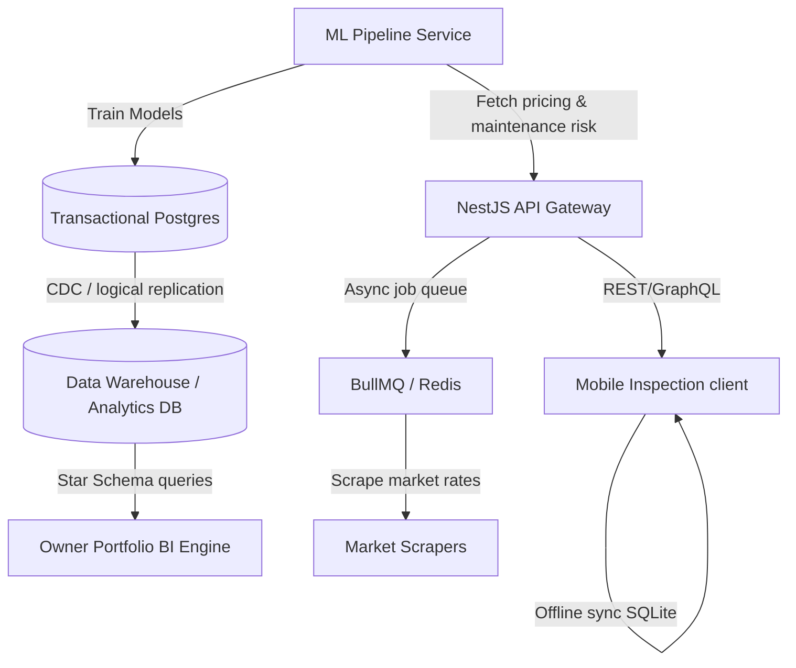

# Phase 6: Scale and Differentiation

Date: 2026-06-07

Scope: Ongoing scalability, intelligence layer, field operations, and market expansion.

## 1. Overview & Strategy

Phase 6 shifts the platform from a stabilized, highly compliant operational baseline (MVP through Phase 5) into a high-moat, predictive operating system. The core strategy centers on **automating cognitive overhead** for operators while expanding the system's geographical and functional reach.

Every module in Phase 6 adheres to the canonical decision-support chain:
```
[Signal] ➔ [Evidence] ➔ [Policy] ➔ [Recommendation] ➔ [Human Approval] ➔ [Execution] ➔ [State Change] ➔ [Audit] ➔ [Measurement]
```

---

## 2. Core Modules Specification

### 2.1 Advanced Rent Optimization
**Objective**: Shift from static rent pricing to dynamic, localized yield management.

- **Signals**: Local vacancy rates rising, unit vacancy duration exceeding threshold, lease renewal window opening, competitor rate drops.
- **Evidence**: Real-time competitor listings (via syndication integrations and scrapers), regional census/economic indexes, unit attributes, and historical lease velocity.
- **Policy**: Owner-defined floor rates, maximum discount thresholds, local rental rate caps (if applicable), and tenant retention rules.
- **Recommendation**: Generated optimal rent pricing for renewals and new listings with confidence metrics (e.g., "92% likelihood to lease within 14 days").
- **Approval & Audit**: All pricing adjustments require human verification. Audit records store the competitor benchmark snapshot and pricing factors used.

### 2.2 Predictive Maintenance
**Objective**: Move maintenance from reactive emergency triage to proactive lifecycle management.

- **Telemetry & Models**: Implement regression models (e.g., Random Forest or XGBoost) to estimate remaining useful life (RUL) of high-value appliances (HVAC, water heaters, roofs) based on age, brand, repair history, and run hours.
- **Signals**: Rising frequency of minor repairs on a specific asset, regional weather forecasts (e.g., heatwave, freeze warnings).
- **Policy**: Capital expenditure limits, owner approval thresholds, service level agreements (SLAs).
- **Execution**: Automatically generate preventive maintenance tickets, recommend pre-emptive replacements during turnovers, and pre-order parts.

### 2.3 Owner Portfolio Analytics & BI
**Objective**: Deliver enterprise-grade asset management metrics directly to property owners.

- **KPI Calculations**:
  - **Cash-on-Cash Yield**: $\frac{\text{Annual Cash Flow}}{\text{Total Cash Invested}}$
  - **Cap Rate**: $\frac{\text{Net Operating Income (NOI)}}{\text{Property Value}}$
  - **Internal Rate of Return (IRR)**: Calculation over hold periods including capital expenditures.
- **Dimensions**: Drill downs by property, portfolio, unit type, region, and vintage.
- **AI Synthesis**: Bookkeeping Agent drafts a natural-language narrative explaining month-over-month variances (e.g., "NOI decreased by 4% due to utility spikes in Building B").

### 2.4 Mobile Field Inspection App
**Objective**: Equip maintenance coordinators and inspectors with an offline-first inspection experience.

- **Offline Sync Protocol**:
  - Local database (SQLite/IndexedDB) buffers checklists, room configurations, and drafts.
  - Conflict resolution: Last-write-wins at block/field levels, but photo attachments are merged chronologically.
  - Queue management: Service workers manage retries for uploading compressed media (HEIC to progressive WebP/JPEG) in background.
- **Features**: Voice-to-text inspection notes, automated checklist adjustment based on unit configuration (e.g., omit fireplace check if none exists).

### 2.5 Vendor Bid Marketplace
**Objective**: Drive down maintenance costs through automated bidding and scoring.

- **Workflow**:
  - **RFP Dispatch**: When a repair exceeds an owner's threshold, the system auto-generates a Request for Proposal (RFP) based on the work order scope.
  - **Bidding Engine**: Invited vendors submit bids, timelines, and material schedules.
  - **Ranking Algorithm**: Rank bids using composite scoring: $\text{Score} = w_1(\text{Price}) + w_2(\text{Availability}) + w_3(\text{Historical Quality Rating}) + w_4(\text{SLA Compliance})$.
- **Verification**: Work order photo submission, invoice comparison, escrowed payout matching.

### 2.6 Jurisdiction-Specific Compliance
**Objective**: Expand out-of-state compliance support while preserving localized legal constraints.

- **Compliance Packs**:
  - **Kansas**: Retain baseline compliance (Security Deposit Interest, Late Fee Limits).
  - **Missouri / Colorado / Oklahoma**: Add state-specific legal engines.
- **Compliance Rules Engine**:
  - Notice periods (e.g., Colorado 3-day vs 10-day notice requirements).
  - Eviction diversion workflows.
  - Local health and safety checklist items.

### 2.7 Automated Monthly Close Assistant
**Objective**: Automate the reconciliation and locking of monthly property books.

- **Automated Checks**:
  - Identify unallocated transactions in `9000` (Suspense).
  - Check for open work orders without corresponding invoices or payments.
  - Scan for ledger imbalances where debits do not match credits.
- **Reconciliation Engine**: Suggest transaction pairings based on text matching, amount thresholds, and date proximity. Provide confidence percentage.
- **Exception Resolution**: Draft plain-language resolution recommendations for human operators (e.g., "Stripe fee discrepancy of $2.50 matches Stripe standard charge; recommend posting to Bank Fees").

### 2.8 Data Warehouse & BI Pipeline
**Objective**: Separate high-volume analytical workloads from the transactional database.

- **ELT Pipeline**: CDC (Change Data Capture) via Debezium or AWS Database Migration Service streaming transaction records into PostgreSQL analytical read replicas or Snowflake.
- **Schema**: Star-schema optimization with explicit fact tables (`fact_ledger_transactions`, `fact_work_orders`) and dimensional tables (`dim_properties`, `dim_leases`, `dim_dates`).

---

## 3. Architecture & Data Flow



### 3.1 Time-Series & Analytic Workloads
- Transactional logs remain in Postgres (`schema.prisma`).
- Read-heavy queries (e.g., portfolio yield over 5 years) utilize specialized indexes or are offloaded to an analytical read replica to prevent transaction lock contention.

### 3.2 Machine Learning Infrastructure
- Model runs are isolated from the core API process to ensure CPU and memory stability.
- Inference triggers on-demand via HTTP microservice or asynchronously through BullMQ workers.
- Training occurs off-peak (daily/weekly) using historical database snapshots.

---

## 4. Implementation Roadmap

### Sprint 1-3: Analytics & Advanced Pricing
- Set up Change Data Capture (CDC) pipelines.
- Implement the baseline Rent Optimization algorithm and competitor scraping feeds.
- Build the core Owner BI schema and variance explainer agent.

### Sprint 4-6: Mobile & Offline Operations
- Build the Mobile Inspection API contract.
- Implement offline sync protocol with conflict resolution inside the React shell / mobile framework.
- Launch the Vendor Bid Marketplace and composite score routing engine.

### Sprint 7-9: Predictive Intelligence & Multi-State Expansion
- Train and deploy the Predictive Maintenance classification/RUL model.
- Expand compliance rule parameters to Missouri and Colorado.
- Implement the Monthly Close Assistant workflow blocker checks.

---

## 5. Success Metrics & Guardrails

- **Dynamic Pricing Accuracy**: Lease velocity should remain within target range ($14 \pm 4$ days) while maximizing effective rent.
- **Model Drift Tracking**: Log predicted HVAC/Appliance lifetimes vs. actual failure dates. Re-train ML models if accuracy drops below 80%.
- **Sync Failure Rate**: Offline mobile sync failure rate must remain $< 0.1\%$; auto-retry mechanisms must resolve network interruptions without data loss.
- **Compliance Audit Coverage**: $100\%$ of jurisdiction-specific actions (e.g., notices sent) must match active regional configuration rules.
